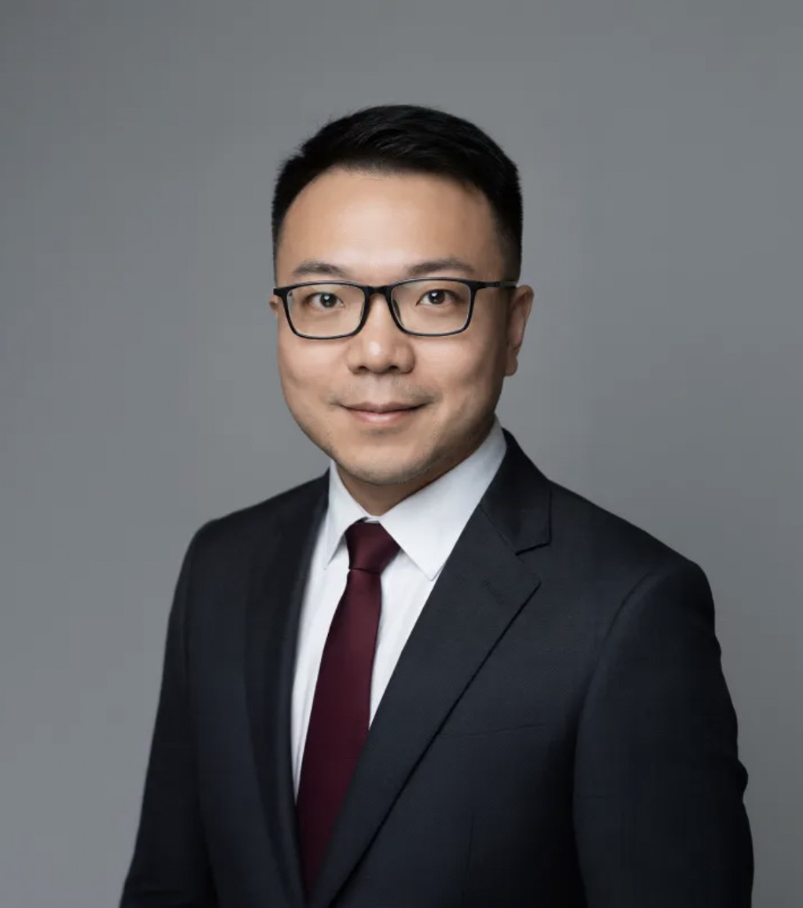

<nav class="site-nav" aria-label="站点导航 Site">
  <a href="index.html">简介 Profile</a>
  ·
  <a href="event.html">活动 Event</a>
  ·
  <a href="#event-top">顶部 Top</a>
  ·
  <a href="#section-theme">主题 Theme</a>
  ·
  <a href="#section-agenda">流程 Agenda</a>
  ·
  <a href="#section-lid">L.I.D.</a>
</nav>

Public Session · 公开分享

# 主题活动 · Session {#event-top}

**嘉宾 Guest ·** [郭峰 GUO Feng](#speaker-block) — TABLE AI 董事长 · OPC Global 创始人 / Secretary-General of the Council 理事会秘书长

<strong>日期 Date：</strong> 2026年6月13日 · 13 June 2026　｜　<strong>时长 Duration：</strong> 30 分钟 · 30 min

## 活动提要 · Event brief {#section-brief}

郭峰，香港 TABLE AI 泰博乐科技有限公司董事长，OPC Global（一人公司全球联盟）创始人 / 理事会秘书长。QS 排名第一的瑞士 EHL 集团中国区创始团队成员，AI 系统架构师，专注人工智能在教育、企业、家庭和个体发展领域的探索与应用，致力于重构个体与组织的成长与协作模式，并为 OPC Global「善用 AI、终获自由」的愿景付出行动。

Guo Feng — Chairman, TABLE AI (Hong Kong); Founder / Secretary-General of the Council, OPC Global. Founding team member of EHL Group Greater China (QS #1 hospitality education). AI systems architect exploring AI across education, enterprise, family, and individual development — reshaping growth and collaboration models toward OPC Global’s vision: use AI wisely, attain freedom.

<strong>Jump:</strong> <a href="#section-theme">主题 Theme</a> · <a href="#section-agenda">议程 Agenda</a> · <a href="#section-lid">L.I.D. 设计逻辑</a> · <a href="index.html">返回简历 Profile</a>

---

## 主题 · Theme {#section-theme}

**中文：** 当 AI 让代码平权、智商廉价，真 OPC 的护城河在哪里？

When AI democratizes code and commoditizes “IQ,” where is the real moat for a true OPC?

**副标题 · Subtitle：** 为什么技术之外的东西才是你出海的最大壁垒

Why non-technical factors may be your biggest barrier — and asset — when going global.

<strong>关联：</strong> 参见 <a href="#lid-insight">L.I.D. · Insight 洞见</a>（技术与「被相信」）

---

## 流程 · Agenda {#section-agenda}

**嘉宾 Guest：** 郭峰｜TABLE AI 董事长 · OPC Global 创始人 / 理事会秘书长

Guest: Guo Feng — Chairman, TABLE AI · Founder / Secretary-General of the Council, OPC Global

<a href="index.html">→ 完整简历 Full profile</a>

### 一、破局开场（5 min）{#agenda-1}

当 AI 让代码民主化、智商廉价化：技术护城河正在消失。真 OPC 凭什么在出海市场长赢？

Opening (5 min): Code democratization & cheap cognition — technical moats fade. What lets a real OPC win globally?

<strong>跳转：</strong> <a href="#lid-insight">Insight 洞见</a> · <a href="#section-lid">L.I.D. 总览</a>

### 二、构建长期信任资产的三层模型（15 min）{#agenda-2}

A three-layer model for long-term trust assets (15 min).

<strong>跳转：</strong> 本节与 <a href="#section-lid">L.I.D. 框架</a> 对照阅读：<a href="#lid-leverage">Leverage</a> · <a href="#lid-insight">Insight</a> · <a href="#lid-drive">Drive</a>

### 三、洞察分享与落地建议（10 min）{#agenda-3}

在新大航海时代，也许你需要先成为「达芬奇」。

Insights & actionable takeaways (10 min). In a new age of exploration: perhaps become a “Da Vinci” first.

<strong>跳转：</strong> <a href="#lid-drive">Drive 驱动</a> · <a href="#lid-leverage">Leverage 杠杆</a>

---

## 内容设计逻辑 · L.I.D. framework {#section-lid}

本场分享的结构遵循 **L.I.D.**，并与上文议程交叉引用：

### L — Leverage · 杠杆

帮助听众识别自己已有的**信任资产存量**，而不是从零开始。许多独立开发者低估了自身积累的经验、关系与领域判断的市场价值。

Surface trust assets you already have — experience, relationships, domain judgment — instead of starting from zero.

<strong>↔</strong> <a href="#agenda-2">议程 · 第二层模型</a>

### I — Insight · 洞见

反直觉视角：在 AI 时代，决定 OPC 天花板的往往不是技术深度，而是**「被相信的能力」**——许多开发者尚未系统思考这一盲区。

Counter-intuitive: the ceiling is often “being believed,” not raw technical depth.

<strong>↔</strong> <a href="#section-theme">主题 · 护城河</a> · <a href="#agenda-1">开场</a>

### D — Drive · 驱动

用真实案例与可操作路径，帮助听众走出「做完产品不知道下一步」的困境，建立持续出海的**内驱叙事与行动信心**。

Cases and paths to move from “shipped product, now what?” to sustained global momentum.

<strong>↔</strong> <a href="#agenda-3">第三段 · 落地建议</a>

<a href="#event-top">↑ 返回顶部 Back to top</a> · <a href="index.html">简历 Profile</a>

<footer class="site-footer">
OPC Global · TABLE AI · Session outline for 2026-06-13
</footer>
